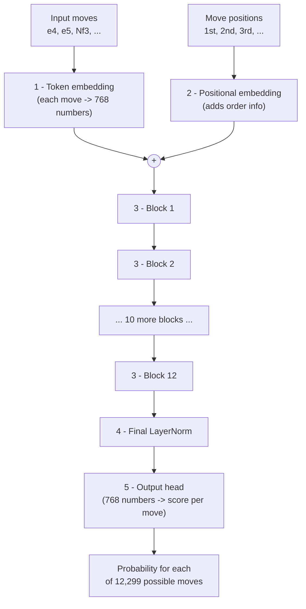
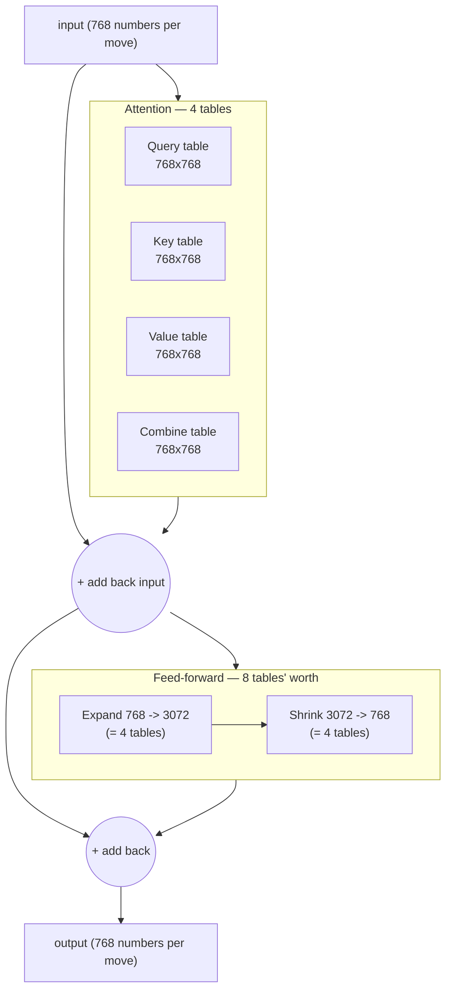

# How model size ("parameters") is calculated — explained for beginners

This doc explains, from zero, what people mean when they say a model has
"104 million parameters," and how you can work that number out yourself —
before you ever train anything. No prior machine-learning knowledge assumed.
We'll use *our* chess model's real numbers throughout.

---

## 1. The one big idea

A neural network is, underneath, just a **giant pile of numbers** arranged into
tables (grids). When the model "learns," it slowly adjusts those numbers until it
gets good at its task.

> **Parameter = one of those adjustable numbers.**

So "104 million parameters" literally means: *the model contains 104 million
individual numbers that get tuned during training.* Counting parameters =
adding up the sizes of every table in the model. That's all it is.

More parameters = more capacity to learn patterns, but also more memory, more
compute, and more data needed to train it well.

---

## 2. The vocabulary you need (plain-language glossary)

These are the only terms you need. Each has a real value in our chess model.

| Term | Plain meaning | Our value |
|------|---------------|-----------|
| **token** | The smallest "word" the model reads. In our chess model, one token = one chess move like `e4` or `Nf3`. | — |
| **vocab** (vocabulary size) | How many *different* tokens exist. We found 12,299 distinct moves in the games. | **12,299** |
| **embedding** | A lookup table that turns each token into a list of numbers the model can do math on (raw text can't be multiplied; numbers can). | — |
| **n_embd** (embedding size / "width") | How many numbers represent each token. Think of it as how much "description" each move gets. Bigger = richer, heavier. | **768** |
| **block_size** (context length) | How many tokens (moves) the model can look back on at once — its "memory span." | **256** |
| **layer** (a "block") | One processing stage. The model stacks several, each refining the last. More layers = "deeper" thinking. | **12** |
| **n_head** | Attention is split into parallel "heads," each looking at different relationships. (Doesn't change the parameter count — see note below.) | 12 |
| **parameter** | One adjustable number. The thing we're counting. | **104.13M total** |

That's the whole nomenclature. Everything below is just arithmetic with these.

---

## 3. A model is built from 5 kinds of tables

Our chess model ([model.py](../model.py)) has exactly five parts that contain
parameters. We count each, then add them up.

Here's the whole model as a picture — moves go in at the top, a next-move
prediction comes out the bottom. The parts in **bold** are the ones holding
parameters:



The 12 blocks in the middle are where ~82% of the parameters live. Now let's
count each part.

The key trick for counting a table: **a table of R rows and C columns holds
R × C numbers.** (A 3-by-5 grid has 15 cells — just like an egg tray.) That
multiplication is 90% of the whole calculation.

> Heads-up on a confusing coincidence: the number **12** shows up a few times in
> this project — our model has 12 layers, and (separately) each block works out
> to "12 tables." Those are unrelated to any example numbers used to explain the
> math below. When you see 12, check *which* 12 it is.

### Part 1 — Token embedding (turn each move into numbers)

We need one row of `n_embd` numbers for *every* possible move (`vocab` of them).
So it's a table with `vocab` rows and `n_embd` columns:

```
vocab × n_embd  =  12,299 × 768  =  9,445,632 parameters
```

### Part 2 — Positional embedding (tell the model the move order)

Attention alone doesn't know which move came first. So we add a second small
table: one row of `n_embd` numbers for each *position* in the context window
(`block_size` of them):

```
block_size × n_embd  =  256 × 768  =  196,608 parameters
```

### Part 3 — The Transformer blocks (the actual "thinking") — the big one

This is where almost all the parameters live. Each **block** has two machines
inside, both built from square `n_embd × n_embd` tables (768 × 768 = 589,824
numbers each). Here's one block as a picture — count the square tables and you
get 12:



So: **4 (attention) + 8 (feed-forward) = 12 tables of 768×768 per block.**
Here's why each block works out to **12 such tables**:

**(a) Attention** — lets each move "look at" earlier moves. It needs 4 tables:

- 3 tables to create a *Query*, *Key*, and *Value* view of each move
  (the mechanics of "what am I looking for / what do I offer / what do I pass on")
- 1 table to combine the result

→ **4 × n_embd²**

**(b) Feed-forward** — a small per-move calculator that expands the data to 4×
the width, does a computation, then shrinks it back:

- expand: `n_embd → 4·n_embd`  = 4 tables' worth
- shrink: `4·n_embd → n_embd`  = 4 tables' worth

→ **8 × n_embd²**

**Per block = 4 + 8 = 12 × n_embd²** = 12 × 589,824 ≈ **7.08 million**
(There are also tiny "LayerNorm" adjustments and biases, but they're a rounding
error — a few thousand out of millions.)

We stack **12** of these blocks:

```
12 blocks × 7.08M each  =  85,026,816 parameters    ← the bulk of the model
```

> **Note on n_head:** splitting attention into 12 heads just *reorganizes* the
> same numbers into parallel groups — it does **not** add parameters. That's why
> n_head isn't in the size formula.

### Part 4 — Final LayerNorm (a tiny cleanup step)

A small normalization with `2 × n_embd` numbers:

```
2 × 768  =  1,536 parameters    (negligible)
```

### Part 5 — Output head (turn numbers back into a move prediction)

After all the thinking, we convert the `n_embd` numbers back into a score for
every possible move, so it's a table of `n_embd × vocab`:

```
n_embd × vocab  =  768 × 12,299  =  9,445,632  (+12,299 biases)  ≈  9,457,931 parameters
```

(Notice this is the same size as the token embedding — input and output both
bridge between "768 numbers" and "12,299 moves.")

---

## 4. Add it all up

| Part | Parameters |
|------|-----------:|
| 1. Token embedding | 9,445,632 |
| 2. Positional embedding | 196,608 |
| 3. The 12 blocks | 85,026,816 |
| 4. Final LayerNorm | 1,536 |
| 5. Output head | 9,457,931 |
| **TOTAL** | **104,128,523** |

That's **104.13 million** — exactly the number training printed. 🎉

And here's where those parameters actually *live* — notice the 12 blocks dwarf
everything else (each `█` ≈ 2M parameters):

```
The 12 blocks   █████████████████████████████████████████  85.0M  (82%)
Output head     ████▌                                        9.5M   (9%)
Token embedding ████▌                                        9.4M   (9%)
Positional emb  ▏                                            0.2M  (~0%)
Final LayerNorm                                              0.0M  (~0%)
```

**Takeaway:** if you want to change the model's size, you change the **blocks**.
Everything else barely moves the needle.

---

## 5. The shortcut formula (estimate size in your head)

You rarely need the full breakdown. Two terms get you within a few percent:

```
parameters  ≈   12 · n_layer · n_embd²     +     2 · vocab · n_embd
                └──── the blocks ────┘            └ embedding + output head ┘
```

For our model:

```
blocks      = 12 · 12 · 768²   = 84.9 million
embed+head  = 2 · 12,299 · 768 = 18.9 million
            ----------------------------------
total       ≈ 103.8 million   ✓  (matches 104.13M)
```

---

## 6. The two levers that control size

Look at the formula and you can see exactly what to turn:

1. **`n_embd` (width) — quadratic, the strongest lever.**
   It's *squared*, so doubling it roughly **quadruples** the model.
   768 → 1536 would take the blocks from ~85M to ~340M.

   ```
   Why "squared"? A table is width × width, so growing the width grows BOTH sides:

   width 768:   ┌────────┐          width 1536:  ┌────────────────┐
                │ 768    │                        │ 1536           │
                │  x     │  = ~0.6M               │   x            │  = ~2.4M
                │ 768    │  numbers               │ 1536           │  numbers
                └────────┘                        │                │  (4x bigger!)
                                                  └────────────────┘
   ```

2. **`n_layer` (depth) — linear.**
   Doubling layers doubles the block params. 12 → 24 ≈ 170M blocks.

   ```
   depth 12:  [B][B][B][B][B][B][B][B][B][B][B][B]            = ~85M
   depth 24:  [B][B][B][B][B][B][B][B][B][B][B][B]
              [B][B][B][B][B][B][B][B][B][B][B][B]            = ~170M  (2x)
   ```

Everything else (`block_size`, `n_head`, `vocab`) has a much smaller effect on
the total. Width and depth are the dials.

### How we actually chose 104M (working backwards)

We wanted about 100M parameters (the most this dataset can train without just
memorizing). Using the formula:

- `12 · n_layer · n_embd²` should be ~85M
- Pick a common width `n_embd = 768`, solve for depth:
  `n_layer = 85M / (12 · 768²) ≈ 12`
- Add the ~19M for embeddings + head → **~104M**. Done — *before* running anything.

A benchmark then confirmed it fit in the GPU's 20 GB of memory.

---

## 7. Check it yourself (one line of code)

Every PyTorch model can be counted directly — this is exactly what
[train.py](../train.py) prints:

```python
total = sum(p.numel() for p in model.parameters())
print(total)   # 104128523
```

`p.numel()` = "number of elements in this table." Summing over every table in
the model gives the parameter count. No mystery — just addition.

---

## TL;DR

- A **parameter** is one tunable number; the count is the sum of all the model's
  number-tables.
- Counting a table = **rows × columns**.
- Almost everything lives in the blocks: **≈ 12 · n_layer · n_embd²**.
- Plus the input/output tables: **≈ 2 · vocab · n_embd**.
- **Width (`n_embd`) is squared** → the dominant lever; **depth (`n_layer`) is linear**.
